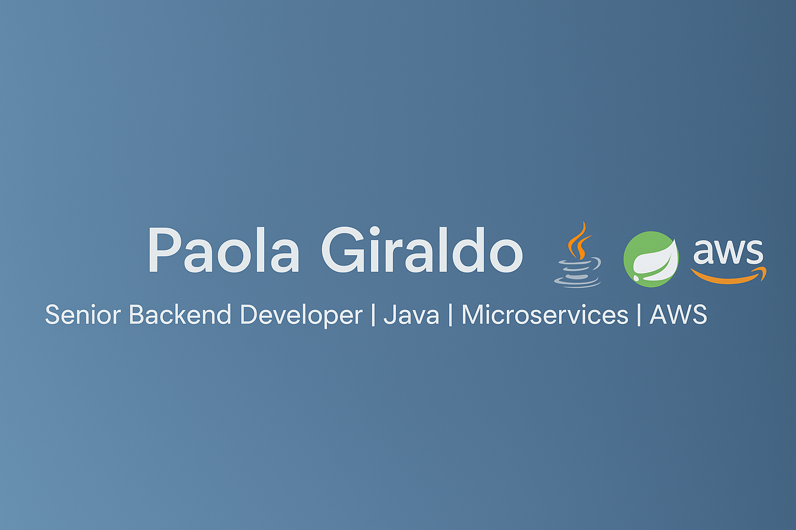

# Hi there 👋, I'm Paola Giraldo  

**Senior Backend Developer | Java | Spring Boot | Microservices | AWS | Kubernetes**  

I am a passionate backend developer with **5+ years of experience** building **scalable and high-performance applications**.  
I specialize in **Java**, **Spring Boot**, and **microservices architecture**, applying **reactive programming** principles to deliver robust solutions.  

I love writing **clean, maintainable code** and working on **cloud-native applications** using **AWS** and **Kubernetes**.  
Currently, I am part of **Bancolombia's engineering team**, contributing to financial inclusion solutions through cutting-edge backend development.  

---

## 🛠️ Tech Stack  

- **Languages:** Java, Python, C#  
- **Frameworks:** Spring Boot, Project Reactor, JUnit, Mockito, React 
- **Cloud & DevOps:** AWS, Kubernetes, Docker, GitLab CI/CD, SonarQube  
- **Databases:** MySQL, PostgreSQL  
- **Architecture:** Microservices, Reactive Programming, RESTful APIs  

---

## 🚀 Featured Projects  

🔹 **[Fintech API](#)** – Microservice for financial operations built with **Java, Spring Boot, and Project Reactor**, deployed on **AWS** with **Kubernetes**.  
🔹 **[IoT Monitoring System](#)** – Event-driven architecture for IoT device monitoring, using **Spring Boot**, **Kafka**, and **PostgreSQL**.  
🔹 **[Traffic Report Generator](#)** – API and web app to analyze and report traffic data, implemented with **Spring Boot** and **RESTful APIs**.  

*(I will be uploading more projects soon!)*  

---

## 📫 How to reach me  

- **Email:** paolagiraldo822@gmail.com  
- **LinkedIn:** [linkedin.com/in/lizette-paola-giraldo-montoya](www.linkedin.com/in/lizette-paola-giraldo-montoya)  
- **GitHub:** [github.com/PaolaGiraldo](https://github.com/PaolaGiraldo)  

---

⭐ **Always open to collaborate on Java, microservices, and cloud-native projects!**
